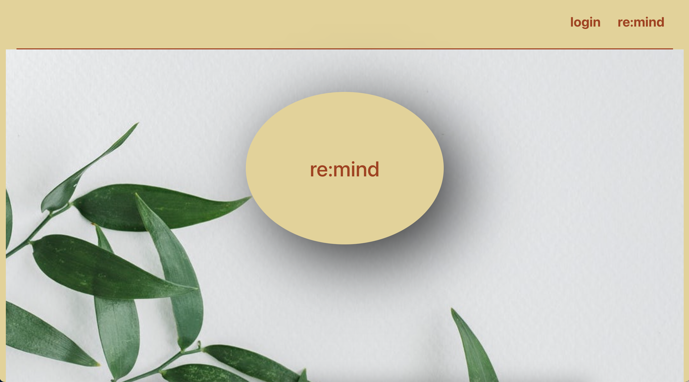
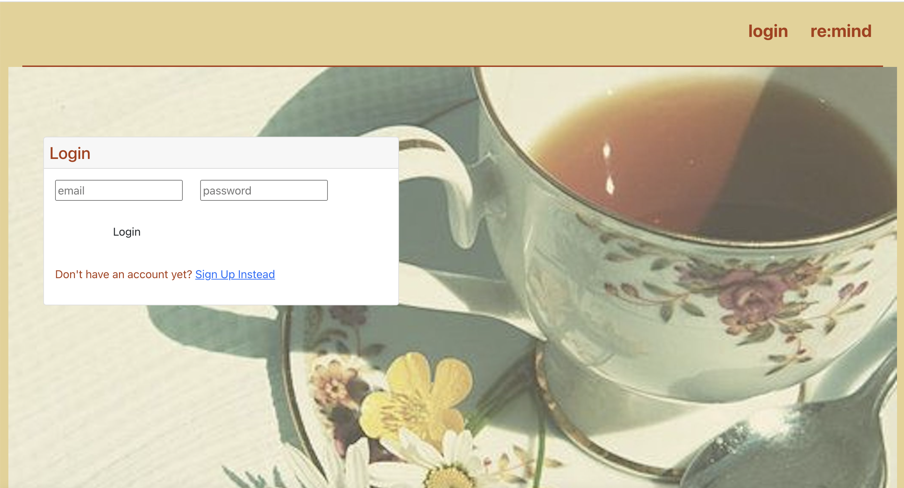
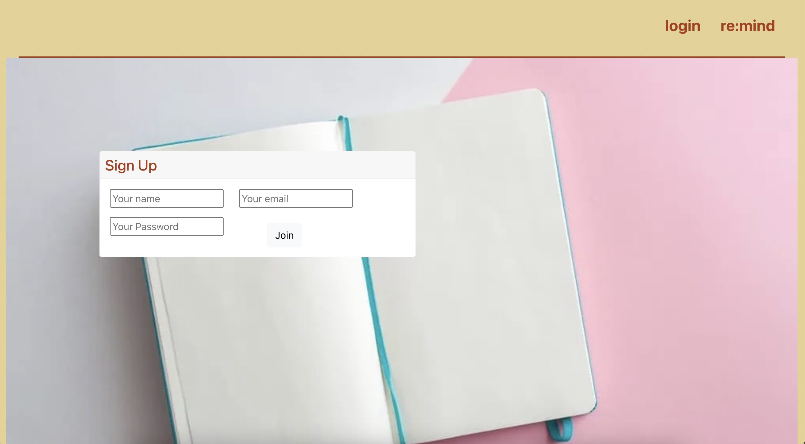
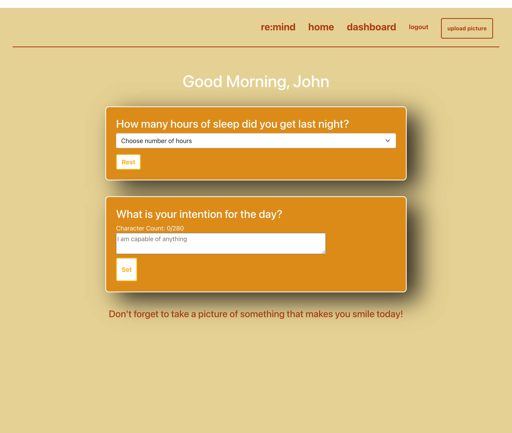
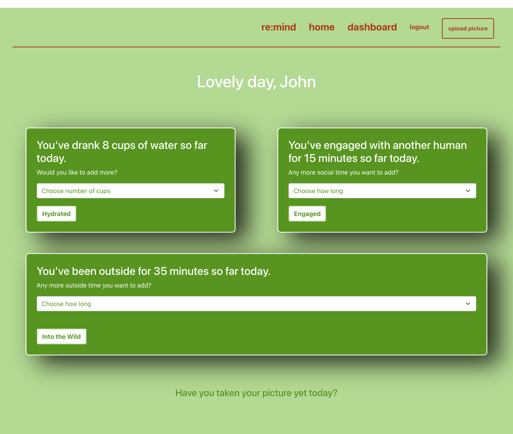
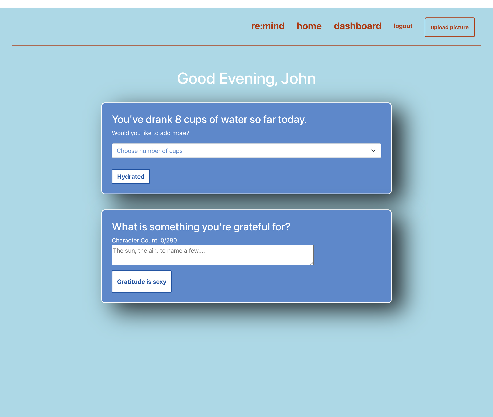
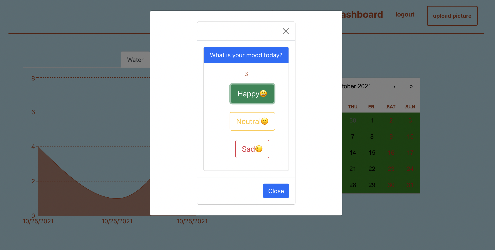
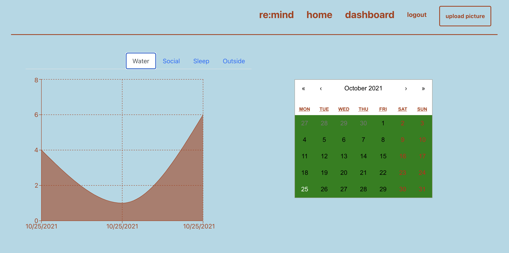

# re:mind

## Description
As we begin to adapt to our new post-COVID environment and develop new routines for self-care, we want the capability to take our wellbeing and happiness into our own hands and find new ways for encouragement and accountability. Additionally, we want to gain new insights on how our physical habits and mental state are intertwined, so that we can modify or improve our own behaviors as we re-integrate and begin rebuilding our communities.

## Table of Contents
  - [Description](#description)
  - [Installation](#installation)
  - [Languages and technologies used](#languages-and-technologies-used)
  - [Usage](#usage)
  - [License](#license)
  - [Contributing](#contributing)
  - [Tests](#tests)
  - [Licensing and copyright](#licensing-and-copyright)

## Installation
To launch the application, please click [here](https://re-mind-app.herokuapp.com/) to view the application on the deployed Heroku site, sign in or log in to your account, and begin documenting your wellness journey.

## Languages and technologies used
This application utilized HTML, CSS, Javascript, Node.js, Express.js, MongoDB, Mongoose, Graphql, Cloudinary SDK and React.

## Usage
Users can document their overall happiness with re:mind. When a user logs into the application, they see the Dashboard, Home, Upload, and Logout links.
  - If it is the morning, the user is greeted by a good morning greeting and the ability to set their intention for the day;
  - If it is the afternoon, the user is greeted by a good afternoon greeting and a prompt to measure how they are feeling
  - If it is the evening, the user is prompted by a good evening greeting and the ability to reflect on what they are grateful for that day.

When the user clicks on the Dashboard, they view a monthly calendar that’s color-coded by the moods they in each day, as well as tabs on the graphs to see their logged amounts of water consumed, time spent with others, time outside, and hours slept for particular days. The user can also click on the Upload link, which allows them to upload a daily photo. Once all information is captured, the user can log out (or keep the application running as they close their broswer).

## Contributing
- Charlotte Clark: <charlotte.clark@alumni.usc.edu>
- Kimberly Rodriguez: <krodriguez.ucla@gmail.com>
- Lyndsey Watson: <lyndseyjwatson@gmail.com>
- Candice Wu: <candice.ying.wu@gmail.com>

## Tests
NA.

## License and copyright
(c) Charlotte Clark, Kimberly Rodriguez, Lyndsey Watson and Candice Wu 

Licensed under the MIT License: [click here](license).

## Appliation Screenshots

re:mind Homepage :

Login Page :

Signup :

Morning Display :

Day Display :

Evening :

Mood Modal Prompt :

Dashboard :

